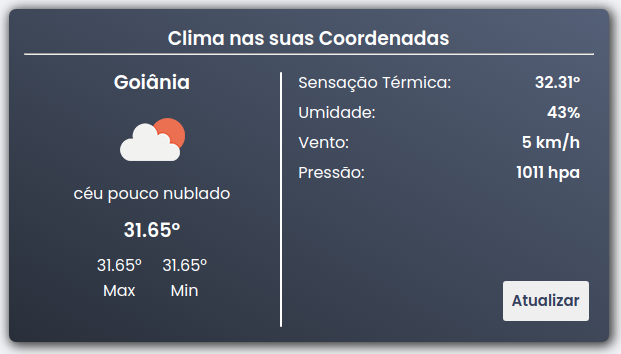
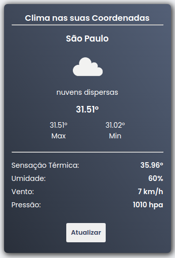

<h1 align="center">
  
</h1>

<h3 align="center">Weather Info Viewer</h3>

## 💻 About this project

 Weather Info Viewer is an application that uses the user's current location and displays weather data for the region, consuming the OpenWeather api

## Demo

 #### Technologies used

  -  [ReactJS](https://reactjs.org/)
  -  [Axios](https://github.com/axios/axios)
  -  [styled-components](https://www.styled-components.com/)

## 🔧 Intalling the project

Assuming you already have a node and a package manager installed

### Clone this repository

#### git clone https://github.com/gabrielrsp/Desafio-Platform-Builders

### Install the dependencies

#### `ex: run yarn`

#### Create your API key from OpenWeather on https://openweathermap.org/

#### Create a .env file on the root of the project and assign the generated api key to an environment variable like the example below

REACT_APP_OPEN_WEATHER_KEY='your-api-key-open-weather-api'

#### Execute the application

#### `ex: yarn start`

#### The application will run on port 3000

Open [http://localhost:3000](http://localhost:3000) to see on the browser

#### To run the StoryBook documentation

#### `yarn storybook`

